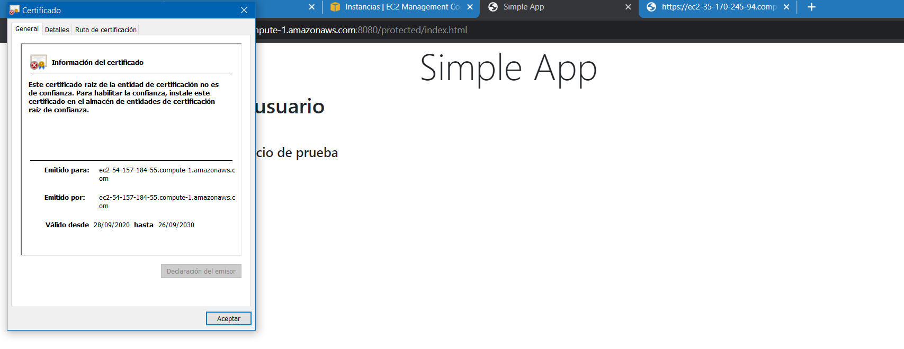
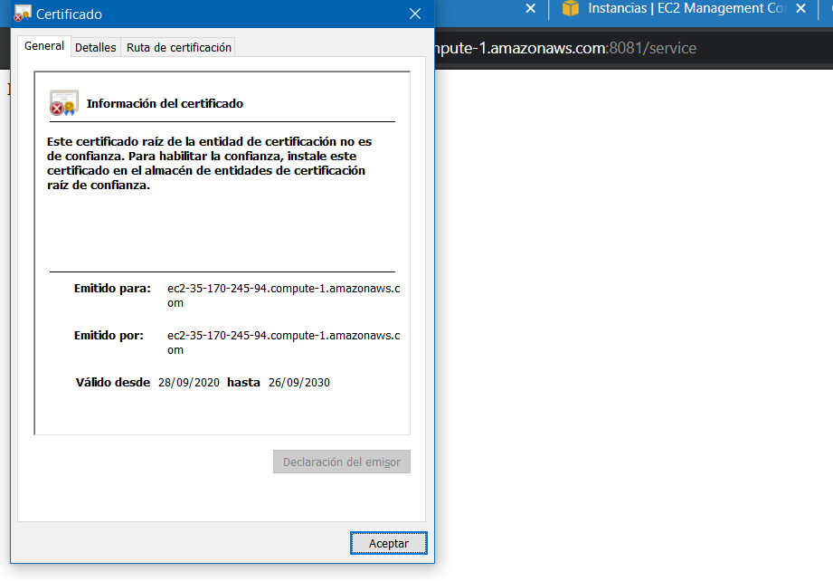
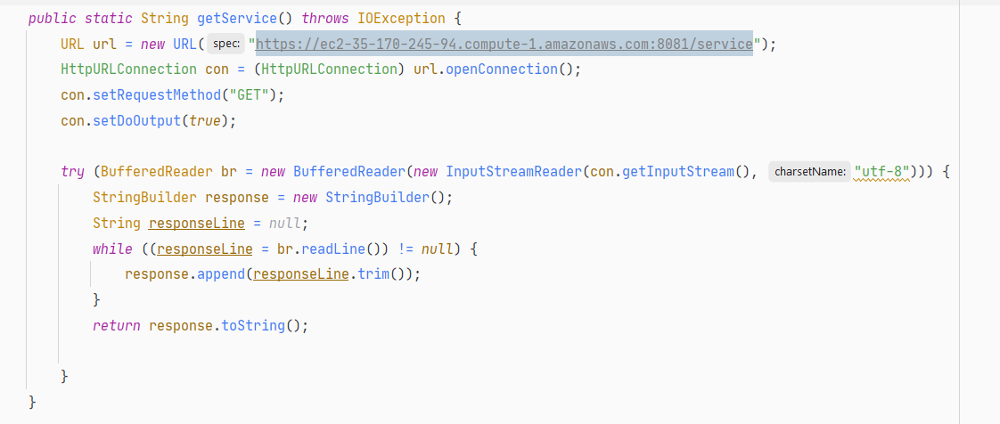
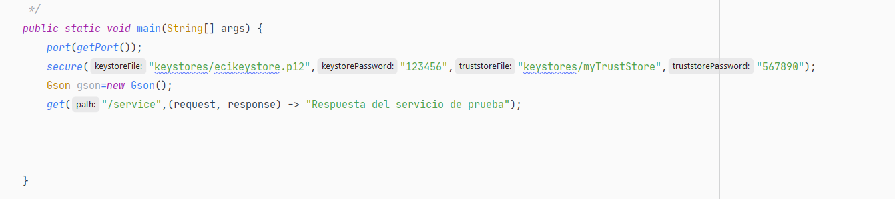
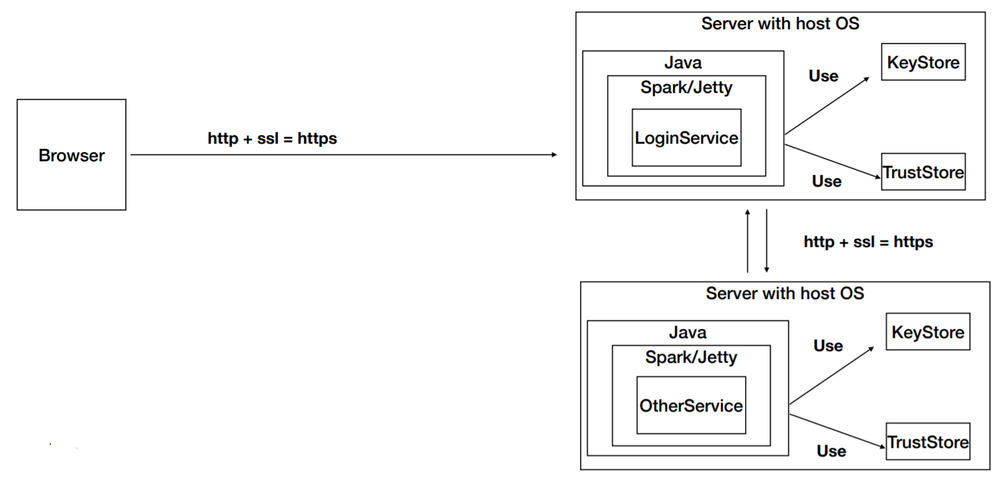
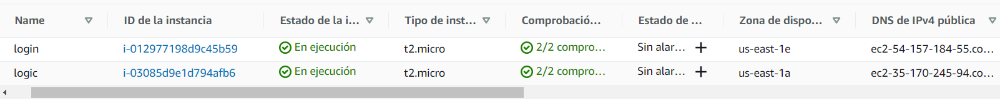

# AREP-Taller All Secure App Spark

El objetivo de este laboratorio es construir una aplicación segura en todos sus frentes, para esto se utilizarán certificados digitales,
adicionalmete se protegerán las peticiones y los recursos estáticos para que solo los usuarios logeados puedan ingresar, para el almacenamiento de contraseñas
se utilizó el algoritmo de hash MD5 

Esta aplicación se desplegó sobre máquinas EC2 de AWS, la comunicación entre los servidores también se realiza usando el protocolo Https.

## Repositorios asociados

[Repositorio Lógica](https://github.com/Jcro15/AREP-LAB7-Secure-App-Logic)

[Repositorio Login](https://github.com/Jcro15/AREP-LAB7-Secure-App-Login)

## Pre-requisitos
* [Maven](https://maven.apache.org/) - Administrador de dependencias
* [Git](https://git-scm.com/) - Sistema de control de versiones
* [Docker](https://www.docker.com/) Sistema de manejo de contenedores 

## Instrucciones de uso

Para descargar el proyecto se debe usar 
```
git clone https://github.com/Jcro15/AREP-LAB7-Secure-App.git
```


Una vez descargado el proyecto este debe compilarse con la siguiente instrucción en cada directorio
```
mvn package
```

Para ejecutar las pruebas del proyecto se debe usar el comando en cada directorio
```
mvn test
```
La documentación se puede encontrar en la carpeta Javadoc o puede generarse en 
la ubicación target\site\apidocs\index.html utilizando el comando en cada directorio
```
mvn javadoc:javadoc
```

## Video demostración
[SimpleApp-Demo](https://www.youtube.com/watch?v=v-F8F5qegTI&feature=youtu.be)
### Certificados AWS
#### Certificado servidor login

#### Certificado servidor servicio


### LLamado a servicio
#### End Point Login 

#### Llamado a servicio

#### End Point Servicio
 


## Arquitectura

## Instancias


## Construido con

* [Maven](https://maven.apache.org/) - Administrador de dependencias
* [Junit](https://junit.org/junit5/) - Framework para pruebas en java
* [Spark](http://sparkjava.com/) - Micro-framework para desarrollar aplicaciones web
* [Docker](https://www.docker.com/) - Sistema de manejo de contenedores

## Autor

* **Juan Camilo Rojas Ortiz** - *Estudiante de ingeniería de sistemas* 

## Licencia

Este proyecto esta bajo la licencia GNU(General Public License) los detalles se pueden encontrar en el archivo [LICENSE](LICENSE)

